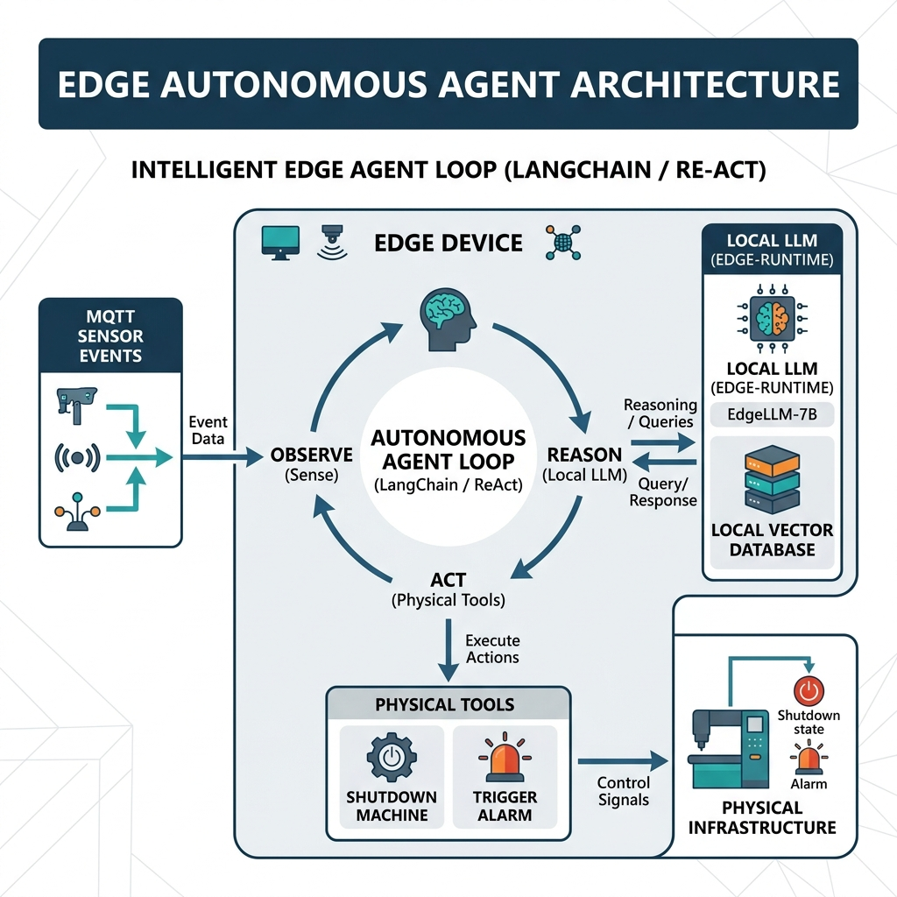
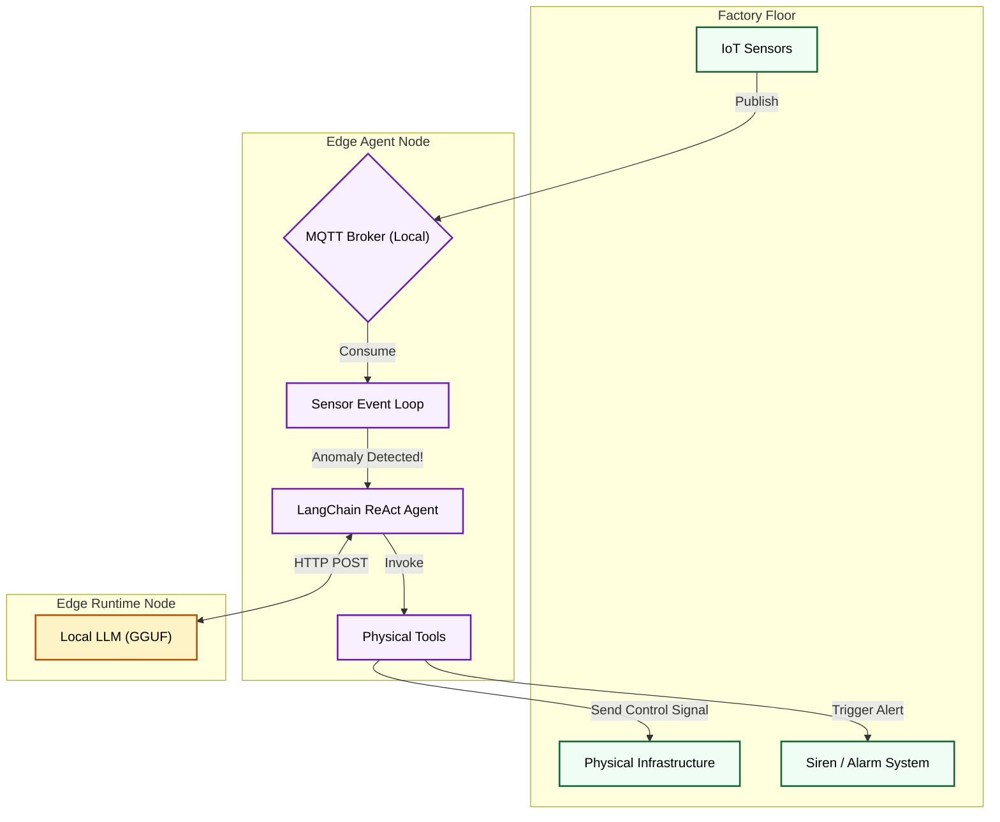

<div align="center">
  
</div>

<h1 align="center">Edge Autonomous Agent</h1>

<p align="center">
  <strong>Intelligent ReAct Daemon for IoT Environments</strong>
</p>

---

## 1. Executive Summary

The **Edge Autonomous Agent** is the 'Brain' of the DevopsTrio local edge node. While `edge-runtime` provides the raw LLM capability, this repository acts as the continuous LangChain daemon that listens to physical world events (via MQTT), reasons about anomalies using the local model, and executes physical tools.

It operates 100% offline, ensuring critical industrial control systems (ICS) remain safe and responsive even if internet connectivity drops.

---

## 2. High-Level Architecture

<div align="center">
  
</div>

### System Flow Diagram


* **Sensor Event Loop**: Uses `aiomqtt` to actively monitor high-throughput sensor telemetry.
* **LangChain Integration**: Connects to an OpenAI-compatible endpoint pointed at `http://edge-runtime:8080/v1` to utilize a local quantized LLM for zero-shot ReAct reasoning.
* **Physical Tools**: Pre-configured LangChain tools like `ShutdownMachineTool` and `TriggerAlarmTool` allow the LLM to impact the real world.

---

## 3. Deployment

Start the agent loop and mock MQTT services locally:

```bash
docker-compose up -d --build
```

### Simulating an Anomaly
Publish a high temperature to the MQTT broker to wake the agent:
```bash
docker exec -it edge-agent_mosquitto_1 mosquitto_pub -t "sensors/motor_A/telemetry" -m '{"temperature": 110.5}'
```
*Watch the docker logs to see the Agent wake up, reason, and trigger the shutdown sequence!*

<hr>
<p align="center">
  <br>
  <i>Autonomous Edge Intelligence.</i>
  <br>
  <b><a href="https://devopstrio.com">© 2026 DevopsTrio Consulting. All rights reserved.</a></b>
</p>
